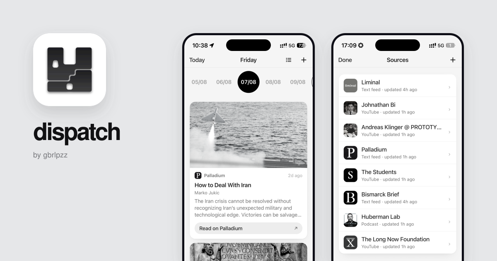

# Dispatch



The Open Graph card is generated from real mobile captures by the reusable
[GBRLPZ preview generator](https://github.com/gbrlpzz/preview).

**A minimal, private, distraction-free personal feed, arranged by day.**

Dispatch is a small, focused tool in the spirit of *minimal, effective,
undistracted, private* software: one screen, your feeds, nothing else.
Your subscriptions become a focused daily reading stream you can swipe through —
a row of live date bubbles up top, the selected day below, and a swipe left or right
to move between days. Every day shows the articles, videos and podcast episodes your
sources published that day, with cards that link out to the Substack, YouTube
or Apple Podcasts apps. No algorithm, no notifications, no feed of feeds —
just what you chose to follow, when it appeared.

Everything runs in your browser and everything stays on your device:

- **No account, no backend, no central infrastructure.** Dispatch is a static
  PWA — anyone can host it (or just open the hosted version) and get a
  personalized feed.
- **Local persistence.** Sources and feed items live in IndexedDB on
  your device, and Dispatch asks the browser for persistent storage, so your
  history survives restarts and works offline.
- **Desktop-friendly updates.** An installed copy checks for a new app shell
  when it opens and reloads into it automatically, while IndexedDB stays
  untouched. A small local source manifest can restore your subscriptions if
  the browser ever evicts the database.
- **Local feed pulling.** Feed fetching happens in your browser. Feeds that
  allow direct access are read directly; feeds that block browser requests
  fall back to a small list of public CORS proxies, in order. No feed data
  ever touches a server you don't choose.

## Features

- **Arranged by day.** A spotlight carousel of circular day bubbles: scroll
  the strip and dates slide through a fixed centre — whatever lands there
  becomes the selected day. The weekday title stays perfectly centred, and the
  day view swipes left and right like a pager. Built to the Apple Human
  Interface Guidelines with a monochrome palette that follows light/dark
  appearance. Swiping beats scrolling: one day, one glance.
- **Three kinds of sources, fully extracted.**
  - *Text* — Substack and any RSS/Atom feed: cover image (pulled from the
    post's media, first embedded image, or article Open Graph metadata),
    byline, and a pulled summary.
    Substack audio posts keep this same editorial card layout, with their
    duration in the metadata and a **Listen** action.
  - *Video* — YouTube channels, using the channel's long-form **Videos**
    playlist so Shorts are excluded, with thumbnail, title, channel profile
    icon and a duration badge where the feed provides one.
  - *Podcast* — native audio RSS feeds, with artwork or the show's source logo,
    show name, episode duration and a link into Apple Podcasts (resolved via
    the iTunes search API at add time).
- **Manage sources.** A Sources screen lists everything you follow, with
  swipe-to-delete. Removing a source removes its items from the past, the
  present and the future.
- **Automatic refresh.** Dispatch re-fetches stale sources when you open it,
  when the app returns to the foreground, and periodically while it's open.
  Pull down on any day to refresh immediately.
- **Explicit provenance.** Actions identify the destination: “Read on
  Palladium”, “Read on Substack”, “Listen on Substack”, “Watch on YouTube”,
  or “Listen on Apple Podcasts”.
- **Installable.** Add it to your iPhone home screen (Share → Add to Home
  Screen) — it runs full-screen with its own icon, and works offline thanks
  to the service worker.

## How it works

1. **Adding a source.** Paste the publication, channel, show or feed URL — a
   Substack publication page or profile link (`substack.com/@handle`), a
   YouTube channel page (`/channel/…`, `/c/…`, `/user/…` or `@handle`),
   an Apple Podcasts show page, a podcast RSS URL,
   or any RSS/Atom feed. Dispatch adapts the URL to the underlying feed,
   fetches it, classifies it (text / video / podcast), and stores it locally.
   For podcasts it also
   looks up the show on Apple Podcasts so cards can deep-link into the app.
2. **Fetching.** Feeds are parsed in the browser (RSS 2.0, Atom, and the
   YouTube Videos playlist feed). Each item is bucketed into the *device-local*
   day its `pubDate` falls on, deduplicated by GUID, and stored in IndexedDB.
3. **The calendar.** The strip covers roughly 4 months back and 2 weeks
   forward from today, extending as you scroll. Each bubble shows a live
   day/month date; the day view shows that day's feed items newest-first.
4. **Refresh scheduling.** There is no background daemon — iOS doesn't allow
   web apps to fetch in the background. Instead Dispatch refreshes whenever
   you open it or bring it to the foreground if any source is older than 12
   hours, and re-checks every 30 minutes while it's open.

## Run locally

Dispatch is a static site — no build step, no dependencies.

```sh
cd dispatch
python3 -m http.server 8787
# open http://localhost:8787
```

For the full install experience (service worker, icons, manifest), serve over
HTTPS or use a tool that sets the right headers:

```sh
npx serve .
```

## Development

The app is plain HTML/CSS/JS — edit and reload. The monochrome home-screen
icons are generated with `scripts/make_icons.py` (Pillow, macOS SF-style
font); re-run it after touching the icon motif.

## Deploy

Any static host works. Vercel (this repo's setup):

```sh
vercel --prod
```

or push to GitHub and import the repo in the Vercel dashboard — `vercel.json`
ships with clean URLs, the correct service-worker headers and the manifest
content type.

## CORS proxies

Most feeds (Substack, YouTube, most podcast hosts) don't send CORS headers,
so a browser can't fetch them directly. Dispatch tries, in order:

1. the feed directly,
2. `cors.io` (fast JSON envelope for Substack and YouTube),
3. `corsproxy.io`,
4. `api.allorigins.win` (raw),
5. `api.codetabs.com`,
6. `api.allorigins.win` (JSON wrapper).

You can edit the `PROXIES` array at the top of `app.js` to use your own
proxy or remove the fallbacks entirely. Note that feed URLs and titles pass
through whatever proxy you choose; the default list only forwards the bytes.

## Privacy

Dispatch stores everything in your browser's IndexedDB and never phones home.
The only network requests are: the feeds you add, the CORS proxies above,
Apple's iTunes Search API (podcast lookup), and YouTube's oEmbed endpoint
(video titles). No analytics, no tracking, no accounts.

## Design

Monochrome Apple Human Interface Guidelines, using the neutral greys from
gabrielepizzi.com (gbrlpzz/index). System grouped background and card
surfaces, translucent blurred navigation bars, label/secondary/tertiary text,
system-fill pills, continuous-corner cards, SF-style glyphs drawn inline,
the iOS motion curves, light and dark appearance, safe-area insets, and a
full-screen standalone experience on iPhone. Text is sized in rem against the
system body font, so iOS Dynamic Type scales the whole interface; the
`prefers-reduced-motion` setting is honoured; every touch target meets the
44pt HIG minimum. Every accent is pure black in light mode and pure white in
dark mode — nothing else, so it reads as one system.

## License

MIT — see [LICENSE](LICENSE).
